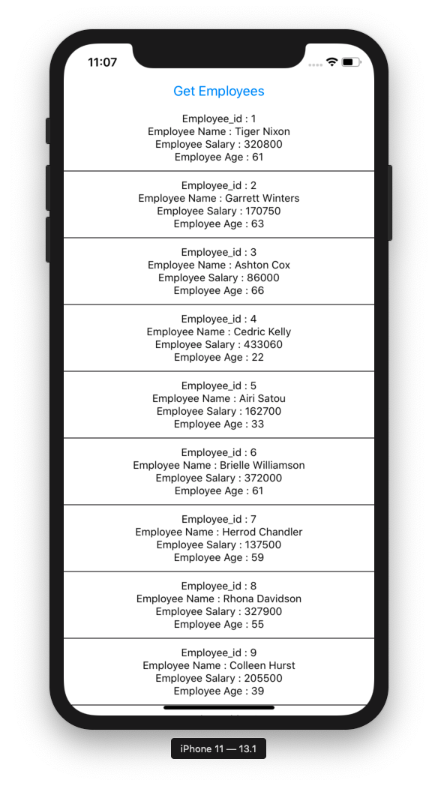

# redux-react-native-thunk

*Readme last updated 22-Jan-2020*

Updated version of [enappd/react-native-redux-thunk](https://github.com/enappd/react-native-redux-thunk)

This "myReduxApp" React Native app was generated freshly, based on the [Async actions with Redux Thunk middleware in React Native apps](https://enappd.com/blog/async-actions-with-redux-thunk-middleware-in-react-native-apps-1/100/) article.

```
$ react-native init myReduxApp
$ cd myReduxApp
$ yarn add redux react-redux redux-thunk
```


